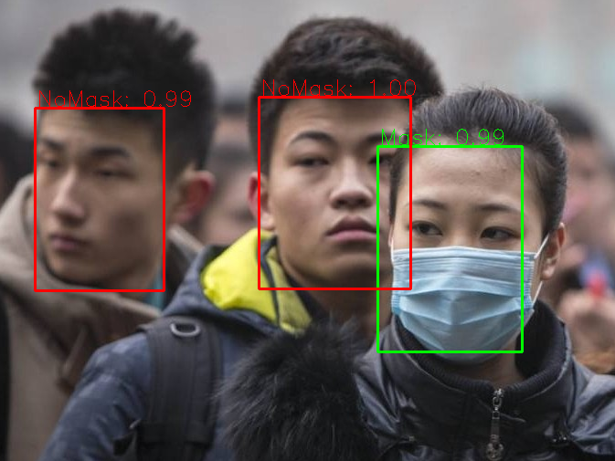
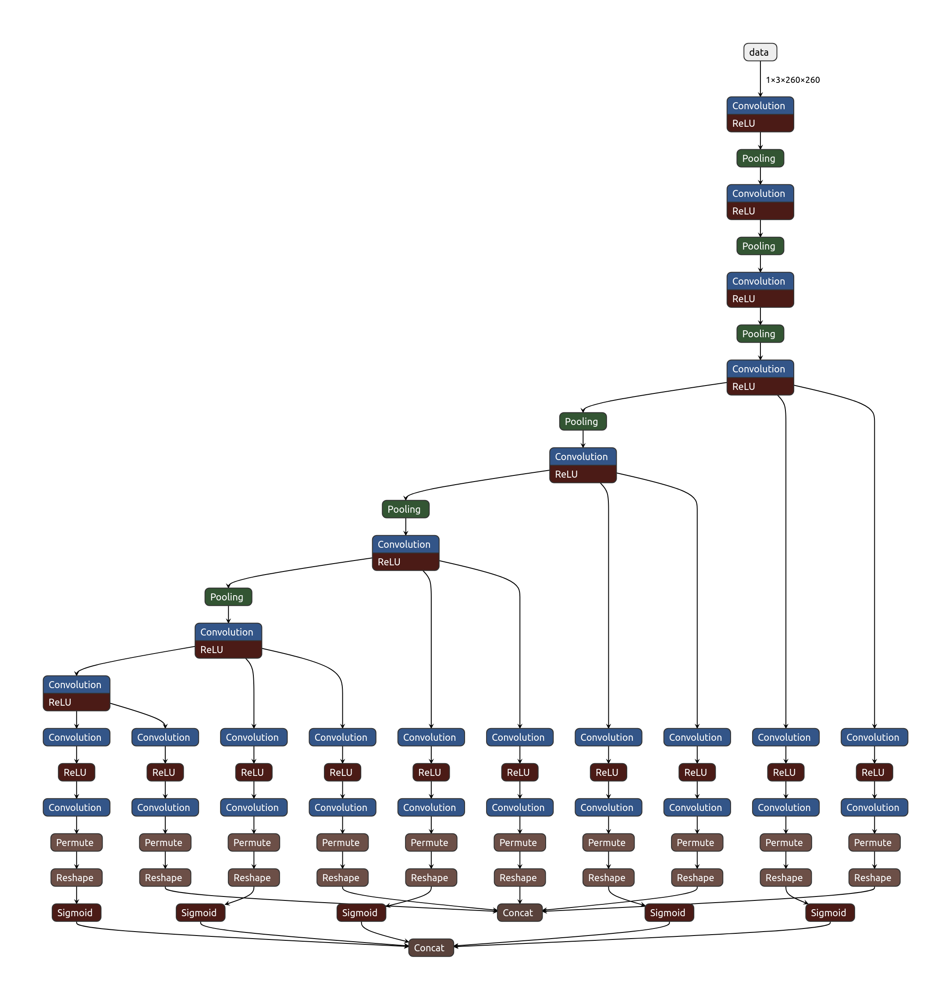
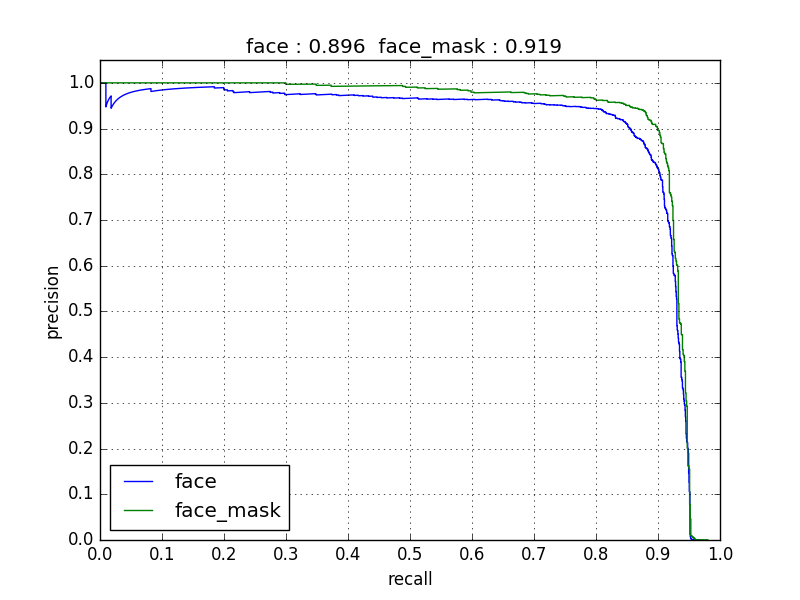

# FaceMaskDetection

We open source all the popular deep learning frameworks' model and inference code to do face mask detection.

- [x] PyTorch
- [x] TensorFlow (include tflite and pb model)
- [x] Keras
- [x] MXNet
- [x] Caffe
- [x] Paddle
- [x] OpenCV dnn

**Detect faces and determine whether they are wearing a mask.**



We published 7971 images to train the models. The dataset is composed of [WIDER Face](http://shuoyang1213.me/WIDERFACE/) and [MAFA](http://www.escience.cn/people/geshiming/mafa.html). You can download it from [Google Drive](https://drive.google.com/file/d/1QspxOJMDf_rAWVV7AU_Nc0rjo1_EPEDW/view?usp=sharing).

---

## Model Structure

SSD-based lightweight model. Input size: **260x260**. Total parameters: **1.01M**.

| Layer | Feature Map | Anchor Size | Aspect Ratio |
|-------|-------------|-------------|--------------|
| First | 33x33 | 0.04, 0.056 | 1, 0.62, 0.42 |
| Second | 17x17 | 0.08, 0.11 | 1, 0.62, 0.42 |
| Third | 9x9 | 0.16, 0.22 | 1, 0.62, 0.42 |
| Fourth | 5x5 | 0.32, 0.45 | 1, 0.62, 0.42 |
| Fifth | 3x3 | 0.64, 0.72 | 1, 0.62, 0.42 |

---

## Installation

```bash
git clone https://github.com/Muawiya-contact/FaceMaskDetection.git
cd FaceMaskDetection

python -m venv .venv

# Windows
.venv\Scripts\activate

# Mac/Linux
source .venv/bin/activate

cd FaceMaskDetection-master
pip install -r requirements.txt
```

---

## How to Run

### Paddle (Recommended)

**Live Webcam:**
```bash
python FaceMaskDetection-master/paddle_infer.py --source 0
```

**Image file:**
```bash
python FaceMaskDetection-master/paddle_infer.py --source path/to/image.jpg
```

> Press `Q` to quit the webcam window.

> If you get an `OneDnnContext` / `fused_conv2d` error, run:
> ```bash
> pip install paddlepaddle==2.6.2
> ```

---

### OpenCV DNN

**Image:**
```bash
python opencv_dnn_infer.py --img-path /path/to/image.jpg
```

**Webcam:**
```bash
python opencv_dnn_infer.py --img-mode 0 --video-path 0
```

---

### PyTorch

**Image:**
```bash
python pytorch_infer.py --img-path /path/to/image.jpg
```

**Webcam:**
```bash
python pytorch_infer.py --img-mode 0 --video-path 0
```

---

### TensorFlow / Keras / MXNet / Caffe

Replace the script name:

```bash
python tensorflow_infer.py --img-path /path/to/image.jpg
python keras_infer.py --img-mode 0 --video-path 0
python caffe_infer.py --img-mode 0 --video-path 0
```

> For Caffe inference, use [caffe-ssd](https://github.com/weiliu89/caffe/tree/ssd) or use `opencv_dnn_infer.py` instead.

---

## Dependencies

| Package | Install |
|---------|---------|
| Base (all scripts) | `pip install opencv-python numpy Pillow` |
| Paddle | `pip install paddlepaddle==2.6.2` |
| PyTorch | `pip install torch torchvision` |
| TensorFlow/Keras | `pip install tensorflow keras h5py` |

Or just run:
```bash
pip install -r requirements.txt
```

---

## Notes

- Use `--video-path 0` or `--source 0` for default webcam. Try `1`, `2` if camera not found.
- On Windows: make sure camera permission is enabled — Settings → Privacy → Camera.
- `opencv_dnn_infer.py` requires `simhei.ttf` for Chinese text rendering.
- The repo includes a pre-converted Paddle model in `models/paddle/` — no need to rerun `x2paddle`.

---

## Appendix

### Model Architecture



### PR Curve

